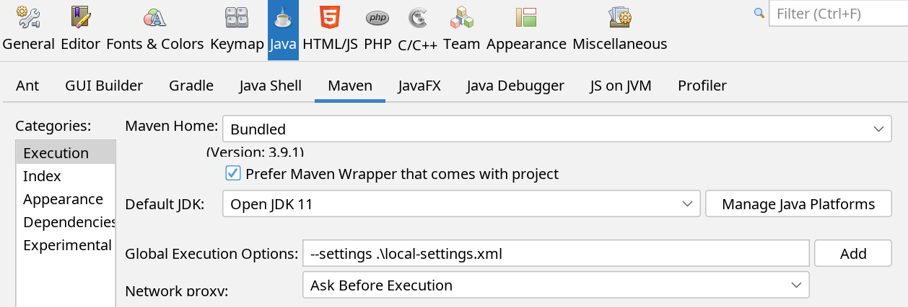
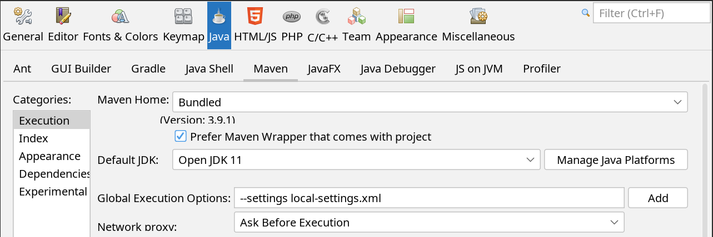

# MestizoPos_EC
Based in Unicenta and OpenBravo for Ecuador


## Software
* Java 11
* Maria db 10
* Maven

## Install software and configure (Windows)
* Install JDK 11
* Install chocolatey https://community.chocolatey.org/
* Run powershell as Administrator, and then install maven 
```
choco install maven
```

## Important set path of JDK 11 (Windows)
Set JAVA_HOME and set jdk path. Not set jre path. 

## Create database and user
```
CREATE SCHEMA mestizo;
CREATE USER 'mestizo'@'%' IDENTIFIED BY 'Mi_Secreto0';
GRANT ALL PRIVILEGES ON mestizo.* TO 'mestizo'@'%' WITH GRANT OPTION;
```
### Update password user
```
ALTER USER 'mestizo'@'%' IDENTIFIED BY 'Mi_Secreto0';
```

## Compile (Windows)
* Get into mestizo directory.
* First delete target directory if exist.
* Compile
```
mvn --settings .\local-settings.xml clean package
```
## Compile (GNU/Linux)
```
mvn --settings local-settings.xml clean package
```
## Run (Windows)
```
java -jar .\target\mestizopos.jar
```
## Run (GNU/Linux)
```
java -jar target\mestizopos.jar
```
## Run with Netbeans
In menu Tools -> Options

### Windows

### GNU/Linux


## Format date and hour
```
yyyy-MM-dd H:mm:ss
```
## Add in start.bat (Windows)
```
@echo off
echo Setting JAVA_HOME
set JAVA_HOME=C:\Java\openjdk-11.0.20
echo JAVA_HOME: %JAVA_HOME%
echo setting PATH
set PATH=%JAVA_HOME%\bin;%Path%
echo PATH: %PATH%
echo Display java version
java -version
```
## Problems
### GNU/Linux
* Obtain hostname
It seems that InetAddress.getLocalHost() ignores the /etc/resolv.conf, but only looks at the /etc/hosts file. 
Adding the IP and hostname to this file solves the problem and the exception is gone.

* Access from remote host to database
In /etc/mysql/mariadb.conf.d/50-server.cnf, update 127.0.0.1 to 0.0.0.0
bind-address            = 127.0.0.1

## Utils
### Show databases
```
show databases
```
### Show users 
```
SELECT User, Db, Host from mysql.db;
```
### Show users grants 
```
select distinct concat('SHOW GRANTS FOR ', QUOTE(user), '@', QUOTE(host), ';') as query from mysql.user;
```
### Show database version 
```
select version()
```
### Show database version 
```
select version()
```
### Restore database
```
mariadb -u root -p mestizo < mestizo.sql
```
